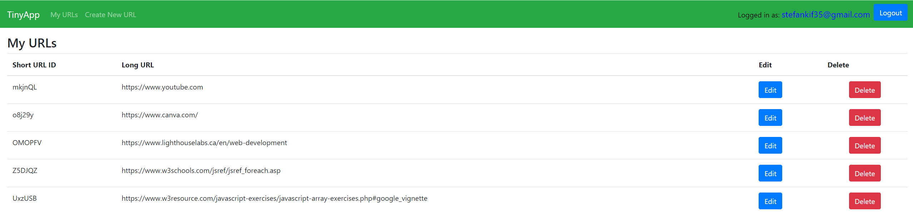
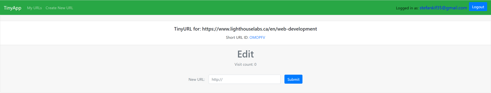

# TinyApp Project

TinyApp is a full stack web application built with Node and Express that allows users to shorten long URLs (à la bit.ly).

## Final Product

## Dependencies

- Node.js
- Express
- EJS
- bcryptjs
- cookie-session

## Getting Started

- Install all dependencies (using the `npm install` command).
- Run the development web server using the `node express_server.js` command.

## This application:
- has authentication protection
- reacts appropriately to the user's logged-in state
- and permits the user to create, read, update, and delete (CRUD) a simple entity (e.g. blog posts, URL shortener).